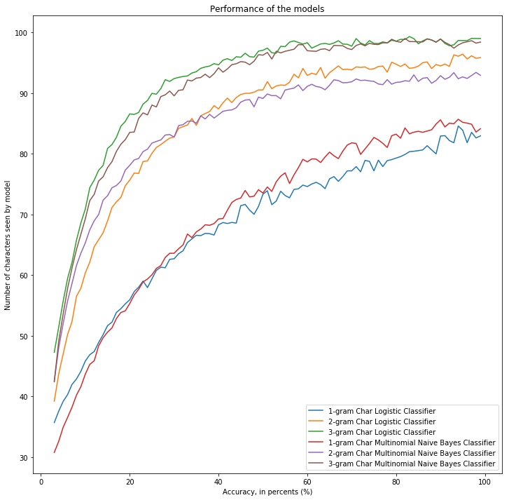

# Sentiment analysis and language identification

This is a project for the Natural Language Processing (NLP) class "IFT-7022 Techniques et applications du traitement automatique de la langue (TALN)" of [Luc Lamontagne](http://www2.ift.ulaval.ca/~lamontagne/). 

## Tasks

There are two tasks to do in this homework: 

- Task 1: classify positive and negative emotion in a document.
- Task 2: predict language in a document.


## License

The current code is released under the **BSD-3-Clause license**. See `LICENSE.md`. Copyright 2018 Guillaume Chevalier.

Note: as this is a university school project, the licences of the imported librairies, datasets, or other assets has not been checked.

## Using the provided data

Here is the structure of the folders for this code to run:

(Note: all text files have been ignored with grep so as to make the tree shorter, and the tree was captured before creating the src* folder. The data could be downloaded from the course website.)


```python
!tree data | grep -v txt | grep -v text
!pwd
```

    data
    ├── task1
    │   └── Book
    │       ├── neg_Bk
    │       └── pos_Bk
    └── task2
        └── identification_langue
            ├── corpus_entrainement
            └── corpus_test1
    
    8 directories, 2044 files
    /home/users_home/Documents/Session 7/NLP/TP2


Also see the `requirements.txt` file: 


```python
!cat requirements.txt
```

    # Python 3.6
    conv
    numpy
    scikit-learn
    nltk
    # nltk.download('stopwords')
    # nltk.download('tagsets')
    # nltk.download('sentiwordnet')
    matplotlib
    


# Task 1: classify positive and negative emotion in a document.


```python
# Python 3.6

import os
import glob

from src.pipeline_steps.nltk_word_tokenize import NLTKTokenizer
from src.pipeline_steps.to_lower_case import ToLowerCase
from src.pipeline_steps.remove_stop_words import RemoveStopWords
from src.pipeline_steps.keep_open_classes_only import KeepOpenClassesOnly
from src.pipeline_steps.sentiwordnet import SentiWordNetPosNegAttributes
from src.pipeline_steps.porter_stemmer import PorterStemmerStep
from src.pipeline_steps.data_shape_printer import ShapePrinter
from src.data_loading.task_1 import load_all_data_task_1
from src.text_classifier_pipelines.stop_words_open_class_stemmer.pipeline_factory import find_and_train_best_pipelines
```

    [nltk_data] Downloading package stopwords to /home/gui/nltk_data...
    [nltk_data]   Package stopwords is already up-to-date!
    [nltk_data] Downloading package sentiwordnet to /home/gui/nltk_data...
    [nltk_data]   Package sentiwordnet is already up-to-date!


```python
neg_Bk_files = glob.glob(os.path.join(".", "data", "task1", "Book", "neg_Bk", "*.text"))
pos_Bk_files = glob.glob(os.path.join(".", "data", "task1", "Book", "pos_Bk", "*.text"))

X_train, y_train, X_test, y_test = load_all_data_task_1(neg_Bk_files, pos_Bk_files)

print(len(X_train), len(y_train), len(X_test), len(y_test))
```

    1600 1600 400 400


```python
best_trained_pipelines = find_and_train_best_pipelines(X_train, y_train)
```

    Will start Cross Validation for Logistic Classifiers.
    
    Cross-Validation Grid Search for: 'Logistic Classifier with_lowercase all_attributes with_pos_neg_attribute with_stemming '...
    Best hyperparameters for 'Logistic Classifier with_lowercase all_attributes with_pos_neg_attribute with_stemming ' (3-folds cross validation accuracy score=0.78375):
    {'count_vect_that_remove_unfrequent_words_and_stopwords__lowercase': False, 'count_vect_that_remove_unfrequent_words_and_stopwords__max_df': 0.98, 'count_vect_that_remove_unfrequent_words_and_stopwords__max_features': 50000, 'count_vect_that_remove_unfrequent_words_and_stopwords__min_df': 1, 'count_vect_that_remove_unfrequent_words_and_stopwords__ngram_range': (1, 2), 'count_vect_that_remove_unfrequent_words_and_stopwords__preprocessor': None, 'count_vect_that_remove_unfrequent_words_and_stopwords__strip_accents': None, 'count_vect_that_remove_unfrequent_words_and_stopwords__tokenizer': <function identity at 0x7fcd6caec598>, 'logistic_regression__C': 10000.0}
    
    Cross-Validation Grid Search for: 'Logistic Classifier with_lowercase all_attributes with_pos_neg_attribute '...
    Best hyperparameters for 'Logistic Classifier with_lowercase all_attributes with_pos_neg_attribute ' (3-folds cross validation accuracy score=0.770625):
    {'count_vect_that_remove_unfrequent_words_and_stopwords__lowercase': False, 'count_vect_that_remove_unfrequent_words_and_stopwords__max_df': 0.98, 'count_vect_that_remove_unfrequent_words_and_stopwords__max_features': 50000, 'count_vect_that_remove_unfrequent_words_and_stopwords__min_df': 1, 'count_vect_that_remove_unfrequent_words_and_stopwords__ngram_range': (1, 3), 'count_vect_that_remove_unfrequent_words_and_stopwords__preprocessor': None, 'count_vect_that_remove_unfrequent_words_and_stopwords__strip_accents': None, 'count_vect_that_remove_unfrequent_words_and_stopwords__tokenizer': <function identity at 0x7fcd6caec598>, 'logistic_regression__C': 10000.0}
    
    Cross-Validation Grid Search for: 'Logistic Classifier with_lowercase all_attributes with_stemming '...
    Best hyperparameters for 'Logistic Classifier with_lowercase all_attributes with_stemming ' (3-folds cross validation accuracy score=0.765625):
    {'count_vect_that_remove_unfrequent_words_and_stopwords__lowercase': False, 'count_vect_that_remove_unfrequent_words_and_stopwords__max_df': 0.98, 'count_vect_that_remove_unfrequent_words_and_stopwords__max_features': 50000, 'count_vect_that_remove_unfrequent_words_and_stopwords__min_df': 1, 'count_vect_that_remove_unfrequent_words_and_stopwords__ngram_range': (1, 2), 'count_vect_that_remove_unfrequent_words_and_stopwords__preprocessor': None, 'count_vect_that_remove_unfrequent_words_and_stopwords__strip_accents': None, 'count_vect_that_remove_unfrequent_words_and_stopwords__tokenizer': <function identity at 0x7fcd6caec598>, 'logistic_regression__C': 10000.0}
    
    Cross-Validation Grid Search for: 'Logistic Classifier with_lowercase all_attributes '...
    Best hyperparameters for 'Logistic Classifier with_lowercase all_attributes ' (3-folds cross validation accuracy score=0.75625):
    {'count_vect_that_remove_unfrequent_words_and_stopwords__lowercase': False, 'count_vect_that_remove_unfrequent_words_and_stopwords__max_df': 0.98, 'count_vect_that_remove_unfrequent_words_and_stopwords__max_features': 50000, 'count_vect_that_remove_unfrequent_words_and_stopwords__min_df': 1, 'count_vect_that_remove_unfrequent_words_and_stopwords__ngram_range': (1, 3), 'count_vect_that_remove_unfrequent_words_and_stopwords__preprocessor': None, 'count_vect_that_remove_unfrequent_words_and_stopwords__strip_accents': None, 'count_vect_that_remove_unfrequent_words_and_stopwords__tokenizer': <function identity at 0x7fcd6caec598>, 'logistic_regression__C': 10000.0}
    
    Cross-Validation Grid Search for: 'Logistic Classifier with_lowercase remove_stop_words with_pos_neg_attribute with_stemming '...
    Best hyperparameters for 'Logistic Classifier with_lowercase remove_stop_words with_pos_neg_attribute with_stemming ' (3-folds cross validation accuracy score=0.739375):
    {'count_vect_that_remove_unfrequent_words_and_stopwords__lowercase': False, 'count_vect_that_remove_unfrequent_words_and_stopwords__max_df': 0.98, 'count_vect_that_remove_unfrequent_words_and_stopwords__max_features': 50000, 'count_vect_that_remove_unfrequent_words_and_stopwords__min_df': 1, 'count_vect_that_remove_unfrequent_words_and_stopwords__ngram_range': (1, 2), 'count_vect_that_remove_unfrequent_words_and_stopwords__preprocessor': None, 'count_vect_that_remove_unfrequent_words_and_stopwords__strip_accents': None, 'count_vect_that_remove_unfrequent_words_and_stopwords__tokenizer': <function identity at 0x7fcd6caec598>, 'logistic_regression__C': 10000.0}
    
    Cross-Validation Grid Search for: 'Logistic Classifier with_lowercase remove_stop_words with_pos_neg_attribute '...
    Best hyperparameters for 'Logistic Classifier with_lowercase remove_stop_words with_pos_neg_attribute ' (3-folds cross validation accuracy score=0.745625):
    {'count_vect_that_remove_unfrequent_words_and_stopwords__lowercase': False, 'count_vect_that_remove_unfrequent_words_and_stopwords__max_df': 0.98, 'count_vect_that_remove_unfrequent_words_and_stopwords__max_features': 50000, 'count_vect_that_remove_unfrequent_words_and_stopwords__min_df': 1, 'count_vect_that_remove_unfrequent_words_and_stopwords__ngram_range': (1, 2), 'count_vect_that_remove_unfrequent_words_and_stopwords__preprocessor': None, 'count_vect_that_remove_unfrequent_words_and_stopwords__strip_accents': None, 'count_vect_that_remove_unfrequent_words_and_stopwords__tokenizer': <function identity at 0x7fcd6caec598>, 'logistic_regression__C': 10000.0}
    
    Cross-Validation Grid Search for: 'Logistic Classifier with_lowercase remove_stop_words with_stemming '...
    Best hyperparameters for 'Logistic Classifier with_lowercase remove_stop_words with_stemming ' (3-folds cross validation accuracy score=0.734375):
    {'count_vect_that_remove_unfrequent_words_and_stopwords__lowercase': False, 'count_vect_that_remove_unfrequent_words_and_stopwords__max_df': 0.98, 'count_vect_that_remove_unfrequent_words_and_stopwords__max_features': 50000, 'count_vect_that_remove_unfrequent_words_and_stopwords__min_df': 1, 'count_vect_that_remove_unfrequent_words_and_stopwords__ngram_range': (1, 2), 'count_vect_that_remove_unfrequent_words_and_stopwords__preprocessor': None, 'count_vect_that_remove_unfrequent_words_and_stopwords__strip_accents': None, 'count_vect_that_remove_unfrequent_words_and_stopwords__tokenizer': <function identity at 0x7fcd6caec598>, 'logistic_regression__C': 10000.0}
    
    Cross-Validation Grid Search for: 'Logistic Classifier with_lowercase remove_stop_words '...
    Best hyperparameters for 'Logistic Classifier with_lowercase remove_stop_words ' (3-folds cross validation accuracy score=0.73875):
    {'count_vect_that_remove_unfrequent_words_and_stopwords__lowercase': False, 'count_vect_that_remove_unfrequent_words_and_stopwords__max_df': 0.98, 'count_vect_that_remove_unfrequent_words_and_stopwords__max_features': 50000, 'count_vect_that_remove_unfrequent_words_and_stopwords__min_df': 1, 'count_vect_that_remove_unfrequent_words_and_stopwords__ngram_range': (1, 2), 'count_vect_that_remove_unfrequent_words_and_stopwords__preprocessor': None, 'count_vect_that_remove_unfrequent_words_and_stopwords__strip_accents': None, 'count_vect_that_remove_unfrequent_words_and_stopwords__tokenizer': <function identity at 0x7fcd6caec598>, 'logistic_regression__C': 10000.0}
    
    Cross-Validation Grid Search for: 'Logistic Classifier with_lowercase keep_open_classes_only with_pos_neg_attribute with_stemming '...
    Best hyperparameters for 'Logistic Classifier with_lowercase keep_open_classes_only with_pos_neg_attribute with_stemming ' (3-folds cross validation accuracy score=0.765):
    {'count_vect_that_remove_unfrequent_words_and_stopwords__lowercase': False, 'count_vect_that_remove_unfrequent_words_and_stopwords__max_df': 0.98, 'count_vect_that_remove_unfrequent_words_and_stopwords__max_features': 50000, 'count_vect_that_remove_unfrequent_words_and_stopwords__min_df': 1, 'count_vect_that_remove_unfrequent_words_and_stopwords__ngram_range': (1, 2), 'count_vect_that_remove_unfrequent_words_and_stopwords__preprocessor': None, 'count_vect_that_remove_unfrequent_words_and_stopwords__strip_accents': None, 'count_vect_that_remove_unfrequent_words_and_stopwords__tokenizer': <function identity at 0x7fcd6caec598>, 'logistic_regression__C': 10000.0}
    
    Cross-Validation Grid Search for: 'Logistic Classifier with_lowercase keep_open_classes_only with_pos_neg_attribute '...
    Best hyperparameters for 'Logistic Classifier with_lowercase keep_open_classes_only with_pos_neg_attribute ' (3-folds cross validation accuracy score=0.758125):
    {'count_vect_that_remove_unfrequent_words_and_stopwords__lowercase': False, 'count_vect_that_remove_unfrequent_words_and_stopwords__max_df': 0.98, 'count_vect_that_remove_unfrequent_words_and_stopwords__max_features': 50000, 'count_vect_that_remove_unfrequent_words_and_stopwords__min_df': 1, 'count_vect_that_remove_unfrequent_words_and_stopwords__ngram_range': (1, 2), 'count_vect_that_remove_unfrequent_words_and_stopwords__preprocessor': None, 'count_vect_that_remove_unfrequent_words_and_stopwords__strip_accents': None, 'count_vect_that_remove_unfrequent_words_and_stopwords__tokenizer': <function identity at 0x7fcd6caec598>, 'logistic_regression__C': 10000.0}
    
    Cross-Validation Grid Search for: 'Logistic Classifier with_lowercase keep_open_classes_only with_stemming '...
    Best hyperparameters for 'Logistic Classifier with_lowercase keep_open_classes_only with_stemming ' (3-folds cross validation accuracy score=0.77125):
    {'count_vect_that_remove_unfrequent_words_and_stopwords__lowercase': False, 'count_vect_that_remove_unfrequent_words_and_stopwords__max_df': 0.98, 'count_vect_that_remove_unfrequent_words_and_stopwords__max_features': 50000, 'count_vect_that_remove_unfrequent_words_and_stopwords__min_df': 1, 'count_vect_that_remove_unfrequent_words_and_stopwords__ngram_range': (1, 2), 'count_vect_that_remove_unfrequent_words_and_stopwords__preprocessor': None, 'count_vect_that_remove_unfrequent_words_and_stopwords__strip_accents': None, 'count_vect_that_remove_unfrequent_words_and_stopwords__tokenizer': <function identity at 0x7fcd6caec598>, 'logistic_regression__C': 10000.0}
    
    Cross-Validation Grid Search for: 'Logistic Classifier with_lowercase keep_open_classes_only '...
    Best hyperparameters for 'Logistic Classifier with_lowercase keep_open_classes_only ' (3-folds cross validation accuracy score=0.751875):
    {'count_vect_that_remove_unfrequent_words_and_stopwords__lowercase': False, 'count_vect_that_remove_unfrequent_words_and_stopwords__max_df': 0.98, 'count_vect_that_remove_unfrequent_words_and_stopwords__max_features': 50000, 'count_vect_that_remove_unfrequent_words_and_stopwords__min_df': 1, 'count_vect_that_remove_unfrequent_words_and_stopwords__ngram_range': (1, 2), 'count_vect_that_remove_unfrequent_words_and_stopwords__preprocessor': None, 'count_vect_that_remove_unfrequent_words_and_stopwords__strip_accents': None, 'count_vect_that_remove_unfrequent_words_and_stopwords__tokenizer': <function identity at 0x7fcd6caec598>, 'logistic_regression__C': 10000.0}
    
    Cross-Validation Grid Search for: 'Logistic Classifier all_attributes with_pos_neg_attribute with_stemming '...
    Best hyperparameters for 'Logistic Classifier all_attributes with_pos_neg_attribute with_stemming ' (3-folds cross validation accuracy score=0.77625):
    {'count_vect_that_remove_unfrequent_words_and_stopwords__lowercase': False, 'count_vect_that_remove_unfrequent_words_and_stopwords__max_df': 0.98, 'count_vect_that_remove_unfrequent_words_and_stopwords__max_features': 50000, 'count_vect_that_remove_unfrequent_words_and_stopwords__min_df': 1, 'count_vect_that_remove_unfrequent_words_and_stopwords__ngram_range': (1, 3), 'count_vect_that_remove_unfrequent_words_and_stopwords__preprocessor': None, 'count_vect_that_remove_unfrequent_words_and_stopwords__strip_accents': None, 'count_vect_that_remove_unfrequent_words_and_stopwords__tokenizer': <function identity at 0x7fcd6caec598>, 'logistic_regression__C': 10000.0}
    
    Cross-Validation Grid Search for: 'Logistic Classifier all_attributes with_pos_neg_attribute '...
    Best hyperparameters for 'Logistic Classifier all_attributes with_pos_neg_attribute ' (3-folds cross validation accuracy score=0.764375):
    {'count_vect_that_remove_unfrequent_words_and_stopwords__lowercase': False, 'count_vect_that_remove_unfrequent_words_and_stopwords__max_df': 0.98, 'count_vect_that_remove_unfrequent_words_and_stopwords__max_features': 50000, 'count_vect_that_remove_unfrequent_words_and_stopwords__min_df': 1, 'count_vect_that_remove_unfrequent_words_and_stopwords__ngram_range': (1, 3), 'count_vect_that_remove_unfrequent_words_and_stopwords__preprocessor': None, 'count_vect_that_remove_unfrequent_words_and_stopwords__strip_accents': None, 'count_vect_that_remove_unfrequent_words_and_stopwords__tokenizer': <function identity at 0x7fcd6caec598>, 'logistic_regression__C': 10000.0}
    
    Cross-Validation Grid Search for: 'Logistic Classifier all_attributes with_stemming '...
    Best hyperparameters for 'Logistic Classifier all_attributes with_stemming ' (3-folds cross validation accuracy score=0.77):
    {'count_vect_that_remove_unfrequent_words_and_stopwords__lowercase': False, 'count_vect_that_remove_unfrequent_words_and_stopwords__max_df': 0.98, 'count_vect_that_remove_unfrequent_words_and_stopwords__max_features': 50000, 'count_vect_that_remove_unfrequent_words_and_stopwords__min_df': 1, 'count_vect_that_remove_unfrequent_words_and_stopwords__ngram_range': (1, 3), 'count_vect_that_remove_unfrequent_words_and_stopwords__preprocessor': None, 'count_vect_that_remove_unfrequent_words_and_stopwords__strip_accents': None, 'count_vect_that_remove_unfrequent_words_and_stopwords__tokenizer': <function identity at 0x7fcd6caec598>, 'logistic_regression__C': 10000.0}
    
    Cross-Validation Grid Search for: 'Logistic Classifier all_attributes '...
    Best hyperparameters for 'Logistic Classifier all_attributes ' (3-folds cross validation accuracy score=0.746875):
    {'count_vect_that_remove_unfrequent_words_and_stopwords__lowercase': False, 'count_vect_that_remove_unfrequent_words_and_stopwords__max_df': 0.98, 'count_vect_that_remove_unfrequent_words_and_stopwords__max_features': 50000, 'count_vect_that_remove_unfrequent_words_and_stopwords__min_df': 1, 'count_vect_that_remove_unfrequent_words_and_stopwords__ngram_range': (1, 2), 'count_vect_that_remove_unfrequent_words_and_stopwords__preprocessor': None, 'count_vect_that_remove_unfrequent_words_and_stopwords__strip_accents': None, 'count_vect_that_remove_unfrequent_words_and_stopwords__tokenizer': <function identity at 0x7fcd6caec598>, 'logistic_regression__C': 10000.0}
    
    Cross-Validation Grid Search for: 'Logistic Classifier remove_stop_words with_pos_neg_attribute with_stemming '...
    Best hyperparameters for 'Logistic Classifier remove_stop_words with_pos_neg_attribute with_stemming ' (3-folds cross validation accuracy score=0.740625):
    {'count_vect_that_remove_unfrequent_words_and_stopwords__lowercase': False, 'count_vect_that_remove_unfrequent_words_and_stopwords__max_df': 0.98, 'count_vect_that_remove_unfrequent_words_and_stopwords__max_features': 50000, 'count_vect_that_remove_unfrequent_words_and_stopwords__min_df': 1, 'count_vect_that_remove_unfrequent_words_and_stopwords__ngram_range': (1, 2), 'count_vect_that_remove_unfrequent_words_and_stopwords__preprocessor': None, 'count_vect_that_remove_unfrequent_words_and_stopwords__strip_accents': None, 'count_vect_that_remove_unfrequent_words_and_stopwords__tokenizer': <function identity at 0x7fcd6caec598>, 'logistic_regression__C': 10000.0}
    
    Cross-Validation Grid Search for: 'Logistic Classifier remove_stop_words with_pos_neg_attribute '...
    Best hyperparameters for 'Logistic Classifier remove_stop_words with_pos_neg_attribute ' (3-folds cross validation accuracy score=0.739375):
    {'count_vect_that_remove_unfrequent_words_and_stopwords__lowercase': False, 'count_vect_that_remove_unfrequent_words_and_stopwords__max_df': 0.98, 'count_vect_that_remove_unfrequent_words_and_stopwords__max_features': 50000, 'count_vect_that_remove_unfrequent_words_and_stopwords__min_df': 1, 'count_vect_that_remove_unfrequent_words_and_stopwords__ngram_range': (1, 2), 'count_vect_that_remove_unfrequent_words_and_stopwords__preprocessor': None, 'count_vect_that_remove_unfrequent_words_and_stopwords__strip_accents': None, 'count_vect_that_remove_unfrequent_words_and_stopwords__tokenizer': <function identity at 0x7fcd6caec598>, 'logistic_regression__C': 10000.0}
    
    Cross-Validation Grid Search for: 'Logistic Classifier remove_stop_words with_stemming '...
    Best hyperparameters for 'Logistic Classifier remove_stop_words with_stemming ' (3-folds cross validation accuracy score=0.734375):
    {'count_vect_that_remove_unfrequent_words_and_stopwords__lowercase': False, 'count_vect_that_remove_unfrequent_words_and_stopwords__max_df': 0.98, 'count_vect_that_remove_unfrequent_words_and_stopwords__max_features': 50000, 'count_vect_that_remove_unfrequent_words_and_stopwords__min_df': 1, 'count_vect_that_remove_unfrequent_words_and_stopwords__ngram_range': (1, 2), 'count_vect_that_remove_unfrequent_words_and_stopwords__preprocessor': None, 'count_vect_that_remove_unfrequent_words_and_stopwords__strip_accents': None, 'count_vect_that_remove_unfrequent_words_and_stopwords__tokenizer': <function identity at 0x7fcd6caec598>, 'logistic_regression__C': 10000.0}
    
    Cross-Validation Grid Search for: 'Logistic Classifier remove_stop_words '...
    Best hyperparameters for 'Logistic Classifier remove_stop_words ' (3-folds cross validation accuracy score=0.729375):
    {'count_vect_that_remove_unfrequent_words_and_stopwords__lowercase': False, 'count_vect_that_remove_unfrequent_words_and_stopwords__max_df': 0.98, 'count_vect_that_remove_unfrequent_words_and_stopwords__max_features': 50000, 'count_vect_that_remove_unfrequent_words_and_stopwords__min_df': 1, 'count_vect_that_remove_unfrequent_words_and_stopwords__ngram_range': (1, 2), 'count_vect_that_remove_unfrequent_words_and_stopwords__preprocessor': None, 'count_vect_that_remove_unfrequent_words_and_stopwords__strip_accents': None, 'count_vect_that_remove_unfrequent_words_and_stopwords__tokenizer': <function identity at 0x7fcd6caec598>, 'logistic_regression__C': 10000.0}
    
    Cross-Validation Grid Search for: 'Logistic Classifier keep_open_classes_only with_pos_neg_attribute with_stemming '...
    Best hyperparameters for 'Logistic Classifier keep_open_classes_only with_pos_neg_attribute with_stemming ' (3-folds cross validation accuracy score=0.759375):
    {'count_vect_that_remove_unfrequent_words_and_stopwords__lowercase': False, 'count_vect_that_remove_unfrequent_words_and_stopwords__max_df': 0.98, 'count_vect_that_remove_unfrequent_words_and_stopwords__max_features': 50000, 'count_vect_that_remove_unfrequent_words_and_stopwords__min_df': 1, 'count_vect_that_remove_unfrequent_words_and_stopwords__ngram_range': (1, 2), 'count_vect_that_remove_unfrequent_words_and_stopwords__preprocessor': None, 'count_vect_that_remove_unfrequent_words_and_stopwords__strip_accents': None, 'count_vect_that_remove_unfrequent_words_and_stopwords__tokenizer': <function identity at 0x7fcd6caec598>, 'logistic_regression__C': 10000.0}
    
    Cross-Validation Grid Search for: 'Logistic Classifier keep_open_classes_only with_pos_neg_attribute '...
    Best hyperparameters for 'Logistic Classifier keep_open_classes_only with_pos_neg_attribute ' (3-folds cross validation accuracy score=0.7575):
    {'count_vect_that_remove_unfrequent_words_and_stopwords__lowercase': False, 'count_vect_that_remove_unfrequent_words_and_stopwords__max_df': 0.98, 'count_vect_that_remove_unfrequent_words_and_stopwords__max_features': 50000, 'count_vect_that_remove_unfrequent_words_and_stopwords__min_df': 1, 'count_vect_that_remove_unfrequent_words_and_stopwords__ngram_range': (1, 2), 'count_vect_that_remove_unfrequent_words_and_stopwords__preprocessor': None, 'count_vect_that_remove_unfrequent_words_and_stopwords__strip_accents': None, 'count_vect_that_remove_unfrequent_words_and_stopwords__tokenizer': <function identity at 0x7fcd6caec598>, 'logistic_regression__C': 10000.0}
    
    Cross-Validation Grid Search for: 'Logistic Classifier keep_open_classes_only with_stemming '...
    Best hyperparameters for 'Logistic Classifier keep_open_classes_only with_stemming ' (3-folds cross validation accuracy score=0.758125):
    {'count_vect_that_remove_unfrequent_words_and_stopwords__lowercase': False, 'count_vect_that_remove_unfrequent_words_and_stopwords__max_df': 0.98, 'count_vect_that_remove_unfrequent_words_and_stopwords__max_features': 50000, 'count_vect_that_remove_unfrequent_words_and_stopwords__min_df': 1, 'count_vect_that_remove_unfrequent_words_and_stopwords__ngram_range': (1, 2), 'count_vect_that_remove_unfrequent_words_and_stopwords__preprocessor': None, 'count_vect_that_remove_unfrequent_words_and_stopwords__strip_accents': None, 'count_vect_that_remove_unfrequent_words_and_stopwords__tokenizer': <function identity at 0x7fcd6caec598>, 'logistic_regression__C': 10000.0}
    
    Cross-Validation Grid Search for: 'Logistic Classifier keep_open_classes_only '...
    Best hyperparameters for 'Logistic Classifier keep_open_classes_only ' (3-folds cross validation accuracy score=0.751875):
    {'count_vect_that_remove_unfrequent_words_and_stopwords__lowercase': False, 'count_vect_that_remove_unfrequent_words_and_stopwords__max_df': 0.98, 'count_vect_that_remove_unfrequent_words_and_stopwords__max_features': 50000, 'count_vect_that_remove_unfrequent_words_and_stopwords__min_df': 1, 'count_vect_that_remove_unfrequent_words_and_stopwords__ngram_range': (1, 2), 'count_vect_that_remove_unfrequent_words_and_stopwords__preprocessor': None, 'count_vect_that_remove_unfrequent_words_and_stopwords__strip_accents': None, 'count_vect_that_remove_unfrequent_words_and_stopwords__tokenizer': <function identity at 0x7fcd6caec598>, 'logistic_regression__C': 10000.0}
    
    Cross-Validation Grid Search for: 'Multinomial Naive Bayes Classifier with_lowercase all_attributes with_pos_neg_attribute with_stemming '...
    Best hyperparameters for 'Multinomial Naive Bayes Classifier with_lowercase all_attributes with_pos_neg_attribute with_stemming ' (3-folds cross validation accuracy score=0.7875):
    {'count_vect_that_remove_unfrequent_words_and_stopwords__lowercase': False, 'count_vect_that_remove_unfrequent_words_and_stopwords__max_df': 0.98, 'count_vect_that_remove_unfrequent_words_and_stopwords__max_features': 50000, 'count_vect_that_remove_unfrequent_words_and_stopwords__min_df': 1, 'count_vect_that_remove_unfrequent_words_and_stopwords__ngram_range': (1, 3), 'count_vect_that_remove_unfrequent_words_and_stopwords__preprocessor': None, 'count_vect_that_remove_unfrequent_words_and_stopwords__strip_accents': None, 'count_vect_that_remove_unfrequent_words_and_stopwords__tokenizer': <function identity at 0x7fcd6caec598>, 'naive_bayes_multi__alpha': 0.1}
    
    Cross-Validation Grid Search for: 'Multinomial Naive Bayes Classifier with_lowercase all_attributes with_pos_neg_attribute '...
    Best hyperparameters for 'Multinomial Naive Bayes Classifier with_lowercase all_attributes with_pos_neg_attribute ' (3-folds cross validation accuracy score=0.79375):
    {'count_vect_that_remove_unfrequent_words_and_stopwords__lowercase': False, 'count_vect_that_remove_unfrequent_words_and_stopwords__max_df': 0.98, 'count_vect_that_remove_unfrequent_words_and_stopwords__max_features': 50000, 'count_vect_that_remove_unfrequent_words_and_stopwords__min_df': 1, 'count_vect_that_remove_unfrequent_words_and_stopwords__ngram_range': (1, 3), 'count_vect_that_remove_unfrequent_words_and_stopwords__preprocessor': None, 'count_vect_that_remove_unfrequent_words_and_stopwords__strip_accents': None, 'count_vect_that_remove_unfrequent_words_and_stopwords__tokenizer': <function identity at 0x7fcd6caec598>, 'naive_bayes_multi__alpha': 0.1}
    
    Cross-Validation Grid Search for: 'Multinomial Naive Bayes Classifier with_lowercase all_attributes with_stemming '...
    Best hyperparameters for 'Multinomial Naive Bayes Classifier with_lowercase all_attributes with_stemming ' (3-folds cross validation accuracy score=0.7825):
    {'count_vect_that_remove_unfrequent_words_and_stopwords__lowercase': False, 'count_vect_that_remove_unfrequent_words_and_stopwords__max_df': 0.98, 'count_vect_that_remove_unfrequent_words_and_stopwords__max_features': 50000, 'count_vect_that_remove_unfrequent_words_and_stopwords__min_df': 1, 'count_vect_that_remove_unfrequent_words_and_stopwords__ngram_range': (1, 3), 'count_vect_that_remove_unfrequent_words_and_stopwords__preprocessor': None, 'count_vect_that_remove_unfrequent_words_and_stopwords__strip_accents': None, 'count_vect_that_remove_unfrequent_words_and_stopwords__tokenizer': <function identity at 0x7fcd6caec598>, 'naive_bayes_multi__alpha': 0.1}
    
    Cross-Validation Grid Search for: 'Multinomial Naive Bayes Classifier with_lowercase all_attributes '...
    Best hyperparameters for 'Multinomial Naive Bayes Classifier with_lowercase all_attributes ' (3-folds cross validation accuracy score=0.79125):
    {'count_vect_that_remove_unfrequent_words_and_stopwords__lowercase': False, 'count_vect_that_remove_unfrequent_words_and_stopwords__max_df': 0.98, 'count_vect_that_remove_unfrequent_words_and_stopwords__max_features': 50000, 'count_vect_that_remove_unfrequent_words_and_stopwords__min_df': 1, 'count_vect_that_remove_unfrequent_words_and_stopwords__ngram_range': (1, 3), 'count_vect_that_remove_unfrequent_words_and_stopwords__preprocessor': None, 'count_vect_that_remove_unfrequent_words_and_stopwords__strip_accents': None, 'count_vect_that_remove_unfrequent_words_and_stopwords__tokenizer': <function identity at 0x7fcd6caec598>, 'naive_bayes_multi__alpha': 0.1}
    
    Cross-Validation Grid Search for: 'Multinomial Naive Bayes Classifier with_lowercase remove_stop_words with_pos_neg_attribute with_stemming '...
    Best hyperparameters for 'Multinomial Naive Bayes Classifier with_lowercase remove_stop_words with_pos_neg_attribute with_stemming ' (3-folds cross validation accuracy score=0.76875):
    {'count_vect_that_remove_unfrequent_words_and_stopwords__lowercase': False, 'count_vect_that_remove_unfrequent_words_and_stopwords__max_df': 0.98, 'count_vect_that_remove_unfrequent_words_and_stopwords__max_features': 50000, 'count_vect_that_remove_unfrequent_words_and_stopwords__min_df': 1, 'count_vect_that_remove_unfrequent_words_and_stopwords__ngram_range': (1, 2), 'count_vect_that_remove_unfrequent_words_and_stopwords__preprocessor': None, 'count_vect_that_remove_unfrequent_words_and_stopwords__strip_accents': None, 'count_vect_that_remove_unfrequent_words_and_stopwords__tokenizer': <function identity at 0x7fcd6caec598>, 'naive_bayes_multi__alpha': 0.1}
    
    Cross-Validation Grid Search for: 'Multinomial Naive Bayes Classifier with_lowercase remove_stop_words with_pos_neg_attribute '...
    Best hyperparameters for 'Multinomial Naive Bayes Classifier with_lowercase remove_stop_words with_pos_neg_attribute ' (3-folds cross validation accuracy score=0.76875):
    {'count_vect_that_remove_unfrequent_words_and_stopwords__lowercase': False, 'count_vect_that_remove_unfrequent_words_and_stopwords__max_df': 0.98, 'count_vect_that_remove_unfrequent_words_and_stopwords__max_features': 50000, 'count_vect_that_remove_unfrequent_words_and_stopwords__min_df': 1, 'count_vect_that_remove_unfrequent_words_and_stopwords__ngram_range': (1, 3), 'count_vect_that_remove_unfrequent_words_and_stopwords__preprocessor': None, 'count_vect_that_remove_unfrequent_words_and_stopwords__strip_accents': None, 'count_vect_that_remove_unfrequent_words_and_stopwords__tokenizer': <function identity at 0x7fcd6caec598>, 'naive_bayes_multi__alpha': 0.1}
    
    Cross-Validation Grid Search for: 'Multinomial Naive Bayes Classifier with_lowercase remove_stop_words with_stemming '...
    Best hyperparameters for 'Multinomial Naive Bayes Classifier with_lowercase remove_stop_words with_stemming ' (3-folds cross validation accuracy score=0.761875):
    {'count_vect_that_remove_unfrequent_words_and_stopwords__lowercase': False, 'count_vect_that_remove_unfrequent_words_and_stopwords__max_df': 0.98, 'count_vect_that_remove_unfrequent_words_and_stopwords__max_features': 50000, 'count_vect_that_remove_unfrequent_words_and_stopwords__min_df': 1, 'count_vect_that_remove_unfrequent_words_and_stopwords__ngram_range': (1, 2), 'count_vect_that_remove_unfrequent_words_and_stopwords__preprocessor': None, 'count_vect_that_remove_unfrequent_words_and_stopwords__strip_accents': None, 'count_vect_that_remove_unfrequent_words_and_stopwords__tokenizer': <function identity at 0x7fcd6caec598>, 'naive_bayes_multi__alpha': 0.1}
    
    Cross-Validation Grid Search for: 'Multinomial Naive Bayes Classifier with_lowercase remove_stop_words '...
    Best hyperparameters for 'Multinomial Naive Bayes Classifier with_lowercase remove_stop_words ' (3-folds cross validation accuracy score=0.756875):
    {'count_vect_that_remove_unfrequent_words_and_stopwords__lowercase': False, 'count_vect_that_remove_unfrequent_words_and_stopwords__max_df': 0.98, 'count_vect_that_remove_unfrequent_words_and_stopwords__max_features': 50000, 'count_vect_that_remove_unfrequent_words_and_stopwords__min_df': 1, 'count_vect_that_remove_unfrequent_words_and_stopwords__ngram_range': (1, 3), 'count_vect_that_remove_unfrequent_words_and_stopwords__preprocessor': None, 'count_vect_that_remove_unfrequent_words_and_stopwords__strip_accents': None, 'count_vect_that_remove_unfrequent_words_and_stopwords__tokenizer': <function identity at 0x7fcd6caec598>, 'naive_bayes_multi__alpha': 0.1}
    
    Cross-Validation Grid Search for: 'Multinomial Naive Bayes Classifier with_lowercase keep_open_classes_only with_pos_neg_attribute with_stemming '...
    Best hyperparameters for 'Multinomial Naive Bayes Classifier with_lowercase keep_open_classes_only with_pos_neg_attribute with_stemming ' (3-folds cross validation accuracy score=0.778125):
    {'count_vect_that_remove_unfrequent_words_and_stopwords__lowercase': False, 'count_vect_that_remove_unfrequent_words_and_stopwords__max_df': 0.98, 'count_vect_that_remove_unfrequent_words_and_stopwords__max_features': 50000, 'count_vect_that_remove_unfrequent_words_and_stopwords__min_df': 1, 'count_vect_that_remove_unfrequent_words_and_stopwords__ngram_range': (1, 3), 'count_vect_that_remove_unfrequent_words_and_stopwords__preprocessor': None, 'count_vect_that_remove_unfrequent_words_and_stopwords__strip_accents': None, 'count_vect_that_remove_unfrequent_words_and_stopwords__tokenizer': <function identity at 0x7fcd6caec598>, 'naive_bayes_multi__alpha': 0.1}
    
    Cross-Validation Grid Search for: 'Multinomial Naive Bayes Classifier with_lowercase keep_open_classes_only with_pos_neg_attribute '...
    Best hyperparameters for 'Multinomial Naive Bayes Classifier with_lowercase keep_open_classes_only with_pos_neg_attribute ' (3-folds cross validation accuracy score=0.7875):
    {'count_vect_that_remove_unfrequent_words_and_stopwords__lowercase': False, 'count_vect_that_remove_unfrequent_words_and_stopwords__max_df': 0.98, 'count_vect_that_remove_unfrequent_words_and_stopwords__max_features': 50000, 'count_vect_that_remove_unfrequent_words_and_stopwords__min_df': 1, 'count_vect_that_remove_unfrequent_words_and_stopwords__ngram_range': (1, 3), 'count_vect_that_remove_unfrequent_words_and_stopwords__preprocessor': None, 'count_vect_that_remove_unfrequent_words_and_stopwords__strip_accents': None, 'count_vect_that_remove_unfrequent_words_and_stopwords__tokenizer': <function identity at 0x7fcd6caec598>, 'naive_bayes_multi__alpha': 0.1}
    
    Cross-Validation Grid Search for: 'Multinomial Naive Bayes Classifier with_lowercase keep_open_classes_only with_stemming '...
    Best hyperparameters for 'Multinomial Naive Bayes Classifier with_lowercase keep_open_classes_only with_stemming ' (3-folds cross validation accuracy score=0.778125):
    {'count_vect_that_remove_unfrequent_words_and_stopwords__lowercase': False, 'count_vect_that_remove_unfrequent_words_and_stopwords__max_df': 0.98, 'count_vect_that_remove_unfrequent_words_and_stopwords__max_features': 50000, 'count_vect_that_remove_unfrequent_words_and_stopwords__min_df': 1, 'count_vect_that_remove_unfrequent_words_and_stopwords__ngram_range': (1, 3), 'count_vect_that_remove_unfrequent_words_and_stopwords__preprocessor': None, 'count_vect_that_remove_unfrequent_words_and_stopwords__strip_accents': None, 'count_vect_that_remove_unfrequent_words_and_stopwords__tokenizer': <function identity at 0x7fcd6caec598>, 'naive_bayes_multi__alpha': 0.1}
    
    Cross-Validation Grid Search for: 'Multinomial Naive Bayes Classifier with_lowercase keep_open_classes_only '...
    Best hyperparameters for 'Multinomial Naive Bayes Classifier with_lowercase keep_open_classes_only ' (3-folds cross validation accuracy score=0.78625):
    {'count_vect_that_remove_unfrequent_words_and_stopwords__lowercase': False, 'count_vect_that_remove_unfrequent_words_and_stopwords__max_df': 0.98, 'count_vect_that_remove_unfrequent_words_and_stopwords__max_features': 50000, 'count_vect_that_remove_unfrequent_words_and_stopwords__min_df': 1, 'count_vect_that_remove_unfrequent_words_and_stopwords__ngram_range': (1, 2), 'count_vect_that_remove_unfrequent_words_and_stopwords__preprocessor': None, 'count_vect_that_remove_unfrequent_words_and_stopwords__strip_accents': None, 'count_vect_that_remove_unfrequent_words_and_stopwords__tokenizer': <function identity at 0x7fcd6caec598>, 'naive_bayes_multi__alpha': 0.1}
    
    Cross-Validation Grid Search for: 'Multinomial Naive Bayes Classifier all_attributes with_pos_neg_attribute with_stemming '...
    Best hyperparameters for 'Multinomial Naive Bayes Classifier all_attributes with_pos_neg_attribute with_stemming ' (3-folds cross validation accuracy score=0.79125):
    {'count_vect_that_remove_unfrequent_words_and_stopwords__lowercase': False, 'count_vect_that_remove_unfrequent_words_and_stopwords__max_df': 0.98, 'count_vect_that_remove_unfrequent_words_and_stopwords__max_features': 50000, 'count_vect_that_remove_unfrequent_words_and_stopwords__min_df': 1, 'count_vect_that_remove_unfrequent_words_and_stopwords__ngram_range': (1, 3), 'count_vect_that_remove_unfrequent_words_and_stopwords__preprocessor': None, 'count_vect_that_remove_unfrequent_words_and_stopwords__strip_accents': None, 'count_vect_that_remove_unfrequent_words_and_stopwords__tokenizer': <function identity at 0x7fcd6caec598>, 'naive_bayes_multi__alpha': 0.1}
    
    Cross-Validation Grid Search for: 'Multinomial Naive Bayes Classifier all_attributes with_pos_neg_attribute '...
    Best hyperparameters for 'Multinomial Naive Bayes Classifier all_attributes with_pos_neg_attribute ' (3-folds cross validation accuracy score=0.785):
    {'count_vect_that_remove_unfrequent_words_and_stopwords__lowercase': False, 'count_vect_that_remove_unfrequent_words_and_stopwords__max_df': 0.98, 'count_vect_that_remove_unfrequent_words_and_stopwords__max_features': 50000, 'count_vect_that_remove_unfrequent_words_and_stopwords__min_df': 1, 'count_vect_that_remove_unfrequent_words_and_stopwords__ngram_range': (1, 3), 'count_vect_that_remove_unfrequent_words_and_stopwords__preprocessor': None, 'count_vect_that_remove_unfrequent_words_and_stopwords__strip_accents': None, 'count_vect_that_remove_unfrequent_words_and_stopwords__tokenizer': <function identity at 0x7fcd6caec598>, 'naive_bayes_multi__alpha': 0.1}
    
    Cross-Validation Grid Search for: 'Multinomial Naive Bayes Classifier all_attributes with_stemming '...
    Best hyperparameters for 'Multinomial Naive Bayes Classifier all_attributes with_stemming ' (3-folds cross validation accuracy score=0.7825):
    {'count_vect_that_remove_unfrequent_words_and_stopwords__lowercase': False, 'count_vect_that_remove_unfrequent_words_and_stopwords__max_df': 0.98, 'count_vect_that_remove_unfrequent_words_and_stopwords__max_features': 50000, 'count_vect_that_remove_unfrequent_words_and_stopwords__min_df': 1, 'count_vect_that_remove_unfrequent_words_and_stopwords__ngram_range': (1, 3), 'count_vect_that_remove_unfrequent_words_and_stopwords__preprocessor': None, 'count_vect_that_remove_unfrequent_words_and_stopwords__strip_accents': None, 'count_vect_that_remove_unfrequent_words_and_stopwords__tokenizer': <function identity at 0x7fcd6caec598>, 'naive_bayes_multi__alpha': 0.1}
    
    Cross-Validation Grid Search for: 'Multinomial Naive Bayes Classifier all_attributes '...
    Best hyperparameters for 'Multinomial Naive Bayes Classifier all_attributes ' (3-folds cross validation accuracy score=0.788125):
    {'count_vect_that_remove_unfrequent_words_and_stopwords__lowercase': False, 'count_vect_that_remove_unfrequent_words_and_stopwords__max_df': 0.98, 'count_vect_that_remove_unfrequent_words_and_stopwords__max_features': 50000, 'count_vect_that_remove_unfrequent_words_and_stopwords__min_df': 1, 'count_vect_that_remove_unfrequent_words_and_stopwords__ngram_range': (1, 3), 'count_vect_that_remove_unfrequent_words_and_stopwords__preprocessor': None, 'count_vect_that_remove_unfrequent_words_and_stopwords__strip_accents': None, 'count_vect_that_remove_unfrequent_words_and_stopwords__tokenizer': <function identity at 0x7fcd6caec598>, 'naive_bayes_multi__alpha': 0.1}
    
    Cross-Validation Grid Search for: 'Multinomial Naive Bayes Classifier remove_stop_words with_pos_neg_attribute with_stemming '...
    Best hyperparameters for 'Multinomial Naive Bayes Classifier remove_stop_words with_pos_neg_attribute with_stemming ' (3-folds cross validation accuracy score=0.77):
    {'count_vect_that_remove_unfrequent_words_and_stopwords__lowercase': False, 'count_vect_that_remove_unfrequent_words_and_stopwords__max_df': 0.98, 'count_vect_that_remove_unfrequent_words_and_stopwords__max_features': 50000, 'count_vect_that_remove_unfrequent_words_and_stopwords__min_df': 1, 'count_vect_that_remove_unfrequent_words_and_stopwords__ngram_range': (1, 2), 'count_vect_that_remove_unfrequent_words_and_stopwords__preprocessor': None, 'count_vect_that_remove_unfrequent_words_and_stopwords__strip_accents': None, 'count_vect_that_remove_unfrequent_words_and_stopwords__tokenizer': <function identity at 0x7fcd6caec598>, 'naive_bayes_multi__alpha': 0.1}
    
    Cross-Validation Grid Search for: 'Multinomial Naive Bayes Classifier remove_stop_words with_pos_neg_attribute '...
    Best hyperparameters for 'Multinomial Naive Bayes Classifier remove_stop_words with_pos_neg_attribute ' (3-folds cross validation accuracy score=0.763125):
    {'count_vect_that_remove_unfrequent_words_and_stopwords__lowercase': False, 'count_vect_that_remove_unfrequent_words_and_stopwords__max_df': 0.98, 'count_vect_that_remove_unfrequent_words_and_stopwords__max_features': 50000, 'count_vect_that_remove_unfrequent_words_and_stopwords__min_df': 1, 'count_vect_that_remove_unfrequent_words_and_stopwords__ngram_range': (1, 3), 'count_vect_that_remove_unfrequent_words_and_stopwords__preprocessor': None, 'count_vect_that_remove_unfrequent_words_and_stopwords__strip_accents': None, 'count_vect_that_remove_unfrequent_words_and_stopwords__tokenizer': <function identity at 0x7fcd6caec598>, 'naive_bayes_multi__alpha': 0.1}
    
    Cross-Validation Grid Search for: 'Multinomial Naive Bayes Classifier remove_stop_words with_stemming '...
    Best hyperparameters for 'Multinomial Naive Bayes Classifier remove_stop_words with_stemming ' (3-folds cross validation accuracy score=0.76375):
    {'count_vect_that_remove_unfrequent_words_and_stopwords__lowercase': False, 'count_vect_that_remove_unfrequent_words_and_stopwords__max_df': 0.98, 'count_vect_that_remove_unfrequent_words_and_stopwords__max_features': 50000, 'count_vect_that_remove_unfrequent_words_and_stopwords__min_df': 1, 'count_vect_that_remove_unfrequent_words_and_stopwords__ngram_range': (1, 3), 'count_vect_that_remove_unfrequent_words_and_stopwords__preprocessor': None, 'count_vect_that_remove_unfrequent_words_and_stopwords__strip_accents': None, 'count_vect_that_remove_unfrequent_words_and_stopwords__tokenizer': <function identity at 0x7fcd6caec598>, 'naive_bayes_multi__alpha': 0.1}
    
    Cross-Validation Grid Search for: 'Multinomial Naive Bayes Classifier remove_stop_words '...
    Best hyperparameters for 'Multinomial Naive Bayes Classifier remove_stop_words ' (3-folds cross validation accuracy score=0.75875):
    {'count_vect_that_remove_unfrequent_words_and_stopwords__lowercase': False, 'count_vect_that_remove_unfrequent_words_and_stopwords__max_df': 0.98, 'count_vect_that_remove_unfrequent_words_and_stopwords__max_features': 50000, 'count_vect_that_remove_unfrequent_words_and_stopwords__min_df': 1, 'count_vect_that_remove_unfrequent_words_and_stopwords__ngram_range': (1, 3), 'count_vect_that_remove_unfrequent_words_and_stopwords__preprocessor': None, 'count_vect_that_remove_unfrequent_words_and_stopwords__strip_accents': None, 'count_vect_that_remove_unfrequent_words_and_stopwords__tokenizer': <function identity at 0x7fcd6caec598>, 'naive_bayes_multi__alpha': 0.1}
    
    Cross-Validation Grid Search for: 'Multinomial Naive Bayes Classifier keep_open_classes_only with_pos_neg_attribute with_stemming '...
    Best hyperparameters for 'Multinomial Naive Bayes Classifier keep_open_classes_only with_pos_neg_attribute with_stemming ' (3-folds cross validation accuracy score=0.78875):
    {'count_vect_that_remove_unfrequent_words_and_stopwords__lowercase': False, 'count_vect_that_remove_unfrequent_words_and_stopwords__max_df': 0.98, 'count_vect_that_remove_unfrequent_words_and_stopwords__max_features': 50000, 'count_vect_that_remove_unfrequent_words_and_stopwords__min_df': 1, 'count_vect_that_remove_unfrequent_words_and_stopwords__ngram_range': (1, 3), 'count_vect_that_remove_unfrequent_words_and_stopwords__preprocessor': None, 'count_vect_that_remove_unfrequent_words_and_stopwords__strip_accents': None, 'count_vect_that_remove_unfrequent_words_and_stopwords__tokenizer': <function identity at 0x7fcd6caec598>, 'naive_bayes_multi__alpha': 0.1}
    
    Cross-Validation Grid Search for: 'Multinomial Naive Bayes Classifier keep_open_classes_only with_pos_neg_attribute '...
    Best hyperparameters for 'Multinomial Naive Bayes Classifier keep_open_classes_only with_pos_neg_attribute ' (3-folds cross validation accuracy score=0.77875):
    {'count_vect_that_remove_unfrequent_words_and_stopwords__lowercase': False, 'count_vect_that_remove_unfrequent_words_and_stopwords__max_df': 0.98, 'count_vect_that_remove_unfrequent_words_and_stopwords__max_features': 50000, 'count_vect_that_remove_unfrequent_words_and_stopwords__min_df': 1, 'count_vect_that_remove_unfrequent_words_and_stopwords__ngram_range': (1, 2), 'count_vect_that_remove_unfrequent_words_and_stopwords__preprocessor': None, 'count_vect_that_remove_unfrequent_words_and_stopwords__strip_accents': None, 'count_vect_that_remove_unfrequent_words_and_stopwords__tokenizer': <function identity at 0x7fcd6caec598>, 'naive_bayes_multi__alpha': 0.1}
    
    Cross-Validation Grid Search for: 'Multinomial Naive Bayes Classifier keep_open_classes_only with_stemming '...
    Best hyperparameters for 'Multinomial Naive Bayes Classifier keep_open_classes_only with_stemming ' (3-folds cross validation accuracy score=0.781875):
    {'count_vect_that_remove_unfrequent_words_and_stopwords__lowercase': False, 'count_vect_that_remove_unfrequent_words_and_stopwords__max_df': 0.98, 'count_vect_that_remove_unfrequent_words_and_stopwords__max_features': 50000, 'count_vect_that_remove_unfrequent_words_and_stopwords__min_df': 1, 'count_vect_that_remove_unfrequent_words_and_stopwords__ngram_range': (1, 3), 'count_vect_that_remove_unfrequent_words_and_stopwords__preprocessor': None, 'count_vect_that_remove_unfrequent_words_and_stopwords__strip_accents': None, 'count_vect_that_remove_unfrequent_words_and_stopwords__tokenizer': <function identity at 0x7fcd6caec598>, 'naive_bayes_multi__alpha': 0.1}
    
    Cross-Validation Grid Search for: 'Multinomial Naive Bayes Classifier keep_open_classes_only '...
    Best hyperparameters for 'Multinomial Naive Bayes Classifier keep_open_classes_only ' (3-folds cross validation accuracy score=0.77625):
    {'count_vect_that_remove_unfrequent_words_and_stopwords__lowercase': False, 'count_vect_that_remove_unfrequent_words_and_stopwords__max_df': 0.98, 'count_vect_that_remove_unfrequent_words_and_stopwords__max_features': 50000, 'count_vect_that_remove_unfrequent_words_and_stopwords__min_df': 1, 'count_vect_that_remove_unfrequent_words_and_stopwords__ngram_range': (1, 3), 'count_vect_that_remove_unfrequent_words_and_stopwords__preprocessor': None, 'count_vect_that_remove_unfrequent_words_and_stopwords__strip_accents': None, 'count_vect_that_remove_unfrequent_words_and_stopwords__tokenizer': <function identity at 0x7fcd6caec598>, 'naive_bayes_multi__alpha': 0.1}
    


```python
print("The final test: classifying on test documents of full-length:")
print("")
print("Note: the test set was of 20% of full data, which was held-out of cross validation.")
print("")
max_score = 0
max_score_model = ""
for (model_name, model) in best_trained_pipelines.items():
    score = model.score(X_test, y_test) * 100
    if score > max_score: 
        max_score = score
        max_score_model = model_name
    print("Test set score for '{}': {}%".format(model_name, score))
print("")
print("Max score is by '{}': {}%".format(max_score_model, max_score))
print("")
```

    The final test: classifying on test documents of full-length:
    
    Note: the test set was of 20% of full data, which was held-out of cross validation.
    
    Test set score for 'Logistic Classifier with_lowercase all_attributes with_pos_neg_attribute with_stemming ': 78.5%
    Test set score for 'Logistic Classifier with_lowercase all_attributes with_pos_neg_attribute ': 77.25%
    Test set score for 'Logistic Classifier with_lowercase all_attributes with_stemming ': 78.5%
    Test set score for 'Logistic Classifier with_lowercase all_attributes ': 76.25%
    Test set score for 'Logistic Classifier with_lowercase remove_stop_words with_pos_neg_attribute with_stemming ': 77.75%
    Test set score for 'Logistic Classifier with_lowercase remove_stop_words with_pos_neg_attribute ': 71.5%
    Test set score for 'Logistic Classifier with_lowercase remove_stop_words with_stemming ': 76.75%
    Test set score for 'Logistic Classifier with_lowercase remove_stop_words ': 70.5%
    Test set score for 'Logistic Classifier with_lowercase keep_open_classes_only with_pos_neg_attribute with_stemming ': 76.5%
    Test set score for 'Logistic Classifier with_lowercase keep_open_classes_only with_pos_neg_attribute ': 75.0%
    Test set score for 'Logistic Classifier with_lowercase keep_open_classes_only with_stemming ': 75.5%
    Test set score for 'Logistic Classifier with_lowercase keep_open_classes_only ': 74.0%
    Test set score for 'Logistic Classifier all_attributes with_pos_neg_attribute with_stemming ': 78.25%
    Test set score for 'Logistic Classifier all_attributes with_pos_neg_attribute ': 78.0%
    Test set score for 'Logistic Classifier all_attributes with_stemming ': 77.25%
    Test set score for 'Logistic Classifier all_attributes ': 76.75%
    Test set score for 'Logistic Classifier remove_stop_words with_pos_neg_attribute with_stemming ': 77.5%
    Test set score for 'Logistic Classifier remove_stop_words with_pos_neg_attribute ': 71.75%
    Test set score for 'Logistic Classifier remove_stop_words with_stemming ': 78.25%
    Test set score for 'Logistic Classifier remove_stop_words ': 71.5%
    Test set score for 'Logistic Classifier keep_open_classes_only with_pos_neg_attribute with_stemming ': 78.5%
    Test set score for 'Logistic Classifier keep_open_classes_only with_pos_neg_attribute ': 74.5%
    Test set score for 'Logistic Classifier keep_open_classes_only with_stemming ': 74.25%
    Test set score for 'Logistic Classifier keep_open_classes_only ': 73.25%
    Test set score for 'Multinomial Naive Bayes Classifier with_lowercase all_attributes with_pos_neg_attribute with_stemming ': 78.75%
    Test set score for 'Multinomial Naive Bayes Classifier with_lowercase all_attributes with_pos_neg_attribute ': 77.0%
    Test set score for 'Multinomial Naive Bayes Classifier with_lowercase all_attributes with_stemming ': 79.75%
    Test set score for 'Multinomial Naive Bayes Classifier with_lowercase all_attributes ': 77.0%
    Test set score for 'Multinomial Naive Bayes Classifier with_lowercase remove_stop_words with_pos_neg_attribute with_stemming ': 79.5%
    Test set score for 'Multinomial Naive Bayes Classifier with_lowercase remove_stop_words with_pos_neg_attribute ': 77.75%
    Test set score for 'Multinomial Naive Bayes Classifier with_lowercase remove_stop_words with_stemming ': 78.5%
    Test set score for 'Multinomial Naive Bayes Classifier with_lowercase remove_stop_words ': 77.25%
    Test set score for 'Multinomial Naive Bayes Classifier with_lowercase keep_open_classes_only with_pos_neg_attribute with_stemming ': 78.5%
    Test set score for 'Multinomial Naive Bayes Classifier with_lowercase keep_open_classes_only with_pos_neg_attribute ': 79.25%
    Test set score for 'Multinomial Naive Bayes Classifier with_lowercase keep_open_classes_only with_stemming ': 79.25%
    Test set score for 'Multinomial Naive Bayes Classifier with_lowercase keep_open_classes_only ': 77.5%
    Test set score for 'Multinomial Naive Bayes Classifier all_attributes with_pos_neg_attribute with_stemming ': 78.5%
    Test set score for 'Multinomial Naive Bayes Classifier all_attributes with_pos_neg_attribute ': 79.5%
    Test set score for 'Multinomial Naive Bayes Classifier all_attributes with_stemming ': 78.75%
    Test set score for 'Multinomial Naive Bayes Classifier all_attributes ': 78.0%
    Test set score for 'Multinomial Naive Bayes Classifier remove_stop_words with_pos_neg_attribute with_stemming ': 79.5%
    Test set score for 'Multinomial Naive Bayes Classifier remove_stop_words with_pos_neg_attribute ': 78.25%
    Test set score for 'Multinomial Naive Bayes Classifier remove_stop_words with_stemming ': 80.5%
    Test set score for 'Multinomial Naive Bayes Classifier remove_stop_words ': 76.75%
    Test set score for 'Multinomial Naive Bayes Classifier keep_open_classes_only with_pos_neg_attribute with_stemming ': 80.25%
    Test set score for 'Multinomial Naive Bayes Classifier keep_open_classes_only with_pos_neg_attribute ': 78.75%
    Test set score for 'Multinomial Naive Bayes Classifier keep_open_classes_only with_stemming ': 78.75%
    Test set score for 'Multinomial Naive Bayes Classifier keep_open_classes_only ': 76.0%
    
    Max score is by 'Multinomial Naive Bayes Classifier remove_stop_words with_stemming ': 80.5%
    


# Task 2: predict language in a document.


```python
# Python 3.6

import os
import glob
from collections import Counter

import nltk

from src.data_loading.task_2 import load_train, load_test
from src.text_classifier_pipelines.char_ngram.logistic import find_and_train_best_logistic_pipeline
from src.text_classifier_pipelines.char_ngram.multinomial_naive_bayes import find_and_train_best_multinomial_pipeline
from src.evaluation.eval_and_plot import eval_and_plot
```

## First: load data.


```python
corpus_train = glob.glob(os.path.join(".", "data", "task2", "identification_langue", "corpus_entrainement", "*.txt"))
corpus_test1 = glob.glob(os.path.join(".", "data", "task2", "identification_langue", "corpus_test1", "*.txt"))

print("Train files found:", corpus_train)
print("")
print("Test files found:", corpus_test1)
print("")

X_train, y_train, labels_readable = load_train(corpus_train, sentence_tokenizer=nltk.sent_tokenize)
X_test, y_test = load_test(corpus_test1, labels_readable)

print("'print(len(X_train), len(y_train))':")
print(len(X_train), len(y_train))
print("'print(len(X_test), len(y_test))':")
print(len(X_test), len(y_test))
print("")
print("Do we have a balanced dataset after counting sentences in train, and items in test?")
print("    Train:", Counter(y_train))
print("    Test:", Counter(y_test))
print("Note: Indices are labels' indexes, and counts are their appearance. Labels are:")
print(list(enumerate(labels_readable)))
print("")
```

    Train files found: ['./data/task2/identification_langue/corpus_entrainement/espanol-training.txt', './data/task2/identification_langue/corpus_entrainement/portuguese-training.txt', './data/task2/identification_langue/corpus_entrainement/french-training.txt', './data/task2/identification_langue/corpus_entrainement/english-training.txt']
    
    Test files found: ['./data/task2/identification_langue/corpus_test1/test15-es.txt', './data/task2/identification_langue/corpus_test1/test26-pt.txt', './data/task2/identification_langue/corpus_test1/test39-es.txt', './data/task2/identification_langue/corpus_test1/test3-fr.txt', './data/task2/identification_langue/corpus_test1/test28-pt.txt', './data/task2/identification_langue/corpus_test1/test40-es.txt', './data/task2/identification_langue/corpus_test1/test12-fr.txt', './data/task2/identification_langue/corpus_test1/test20-fr.txt', './data/task2/identification_langue/corpus_test1/test24-pt.txt', './data/task2/identification_langue/corpus_test1/test35-en.txt', './data/task2/identification_langue/corpus_test1/test4-en.txt', './data/task2/identification_langue/corpus_test1/test14-en.txt', './data/task2/identification_langue/corpus_test1/test9-en.txt', './data/task2/identification_langue/corpus_test1/test33-en.txt', './data/task2/identification_langue/corpus_test1/test13-fr.txt', './data/task2/identification_langue/corpus_test1/test21-pt.txt', './data/task2/identification_langue/corpus_test1/test34-en.txt', './data/task2/identification_langue/corpus_test1/test10-fr.txt', './data/task2/identification_langue/corpus_test1/test30-pt.txt', './data/task2/identification_langue/corpus_test1/test11-es.txt', './data/task2/identification_langue/corpus_test1/test18-fr.txt', './data/task2/identification_langue/corpus_test1/test17-en.txt', './data/task2/identification_langue/corpus_test1/test5-en.txt', './data/task2/identification_langue/corpus_test1/test25-pt.txt', './data/task2/identification_langue/corpus_test1/test31-fr.txt', './data/task2/identification_langue/corpus_test1/test16-en.txt', './data/task2/identification_langue/corpus_test1/test29-pt.txt', './data/task2/identification_langue/corpus_test1/test32-fr.txt', './data/task2/identification_langue/corpus_test1/test2-fr.txt', './data/task2/identification_langue/corpus_test1/test23-pt.txt', './data/task2/identification_langue/corpus_test1/test6-fr.txt', './data/task2/identification_langue/corpus_test1/test22-pt.txt', './data/task2/identification_langue/corpus_test1/test37-es.txt', './data/task2/identification_langue/corpus_test1/test27-pt.txt', './data/task2/identification_langue/corpus_test1/test19-es.txt', './data/task2/identification_langue/corpus_test1/test8-es.txt', './data/task2/identification_langue/corpus_test1/test36-en.txt', './data/task2/identification_langue/corpus_test1/test1-es.txt', './data/task2/identification_langue/corpus_test1/test7-es.txt', './data/task2/identification_langue/corpus_test1/test38-es.txt']
    
    'print(len(X_train), len(y_train))':
    767 767
    'print(len(X_test), len(y_test))':
    40 40
    
    Do we have a balanced dataset after counting sentences in train, and items in test?
        Train: Counter({0: 258, 3: 211, 2: 188, 1: 110})
        Test: Counter({1: 10, 3: 10, 2: 10, 0: 10})
    Note: Indices are labels' indexes, and counts are their appearance. Labels are:
    [(0, 'english'), (1, 'espanol'), (2, 'french'), (3, 'portuguese')]
    


## Then, create Pipeline() classes for scikit-learn

Because here, we want to perform those steps in order: 
1. Lowercase the text (but keep accents).
2. Convert the documents to char ngrams.
3. Use the classifier of our choice later on.

This is done in the `from src.text_classifier_pipelines` local package imported.

## Training First Pipeline: TF-IDF Logistic Classifier.

Cross Validation is performed.


```python
best_trained_logistic_pipelines = find_and_train_best_logistic_pipeline(X_train, y_train)
```

    Will start Cross Validation for Logistic Classifiers.
    
    Cross-Validation Grid Search for: '1-gram'...
    Best hyperparameters for '1-gram' (3-folds cross validation accuracy score=0.924380704041721):
    {'count_vectorizer__lowercase': False, 'count_vectorizer__max_df': 0.98, 'count_vectorizer__max_features': 100000, 'count_vectorizer__min_df': 2, 'count_vectorizer__ngram_range': (1, 1), 'count_vectorizer__preprocessor': None, 'count_vectorizer__strip_accents': None, 'count_vectorizer__tokenizer': <function get_logistic_hyperparams_grid.<locals>.<lambda> at 0x7f3c1c1bb950>, 'logistic_regression__C': 1000.0, 'tf_idf__norm': 'l1', 'tf_idf__smooth_idf': True, 'tf_idf__sublinear_tf': False, 'to_ngram__ngram': 1, 'to_ngram__stride': 1}
    
    Cross-Validation Grid Search for: '2-gram'...
    Best hyperparameters for '2-gram' (3-folds cross validation accuracy score=0.9921773142112125):
    {'count_vectorizer__lowercase': False, 'count_vectorizer__max_df': 0.98, 'count_vectorizer__max_features': 100000, 'count_vectorizer__min_df': 2, 'count_vectorizer__ngram_range': (1, 1), 'count_vectorizer__preprocessor': None, 'count_vectorizer__strip_accents': None, 'count_vectorizer__tokenizer': <function get_logistic_hyperparams_grid.<locals>.<lambda> at 0x7f3c82edb620>, 'logistic_regression__C': 1000.0, 'tf_idf__norm': 'l1', 'tf_idf__smooth_idf': True, 'tf_idf__sublinear_tf': False, 'to_ngram__ngram': 2, 'to_ngram__stride': 1}
    
    Cross-Validation Grid Search for: '3-gram'...
    Best hyperparameters for '3-gram' (3-folds cross validation accuracy score=0.9960886571056062):
    {'count_vectorizer__lowercase': False, 'count_vectorizer__max_df': 0.98, 'count_vectorizer__max_features': 100000, 'count_vectorizer__min_df': 2, 'count_vectorizer__ngram_range': (1, 1), 'count_vectorizer__preprocessor': None, 'count_vectorizer__strip_accents': None, 'count_vectorizer__tokenizer': <function get_logistic_hyperparams_grid.<locals>.<lambda> at 0x7f3c1c2ebc80>, 'logistic_regression__C': 1000.0, 'tf_idf__norm': 'l1', 'tf_idf__smooth_idf': True, 'tf_idf__sublinear_tf': True, 'to_ngram__ngram': 3, 'to_ngram__stride': 1}
    


## Training Second Pipeline: TF-IDF Multinomial Naive Bayes Classifier.

Cross Validation is performed.


```python
best_trained_bayes_pipelines = find_and_train_best_multinomial_pipeline(X_train, y_train)
```

    Will start Cross Validation for Naive Bayes (MultinomialNB) Classifiers.
    
    Cross-Validation Grid Search for: '1-gram'...
    Best hyperparameters for '1-gram' (3-folds cross validation accuracy score=0.9204693611473272):
    {'count_vectorizer__lowercase': False, 'count_vectorizer__max_df': 0.98, 'count_vectorizer__max_features': 100000, 'count_vectorizer__min_df': 2, 'count_vectorizer__ngram_range': (1, 1), 'count_vectorizer__preprocessor': None, 'count_vectorizer__strip_accents': None, 'count_vectorizer__tokenizer': <function get_multinomial_naive_bayes_hyperparams_grid.<locals>.<lambda> at 0x7f3c1c1bbd08>, 'naive_bayes_multiclass__alpha': 0.01, 'tf_idf__norm': None, 'tf_idf__smooth_idf': True, 'tf_idf__sublinear_tf': False, 'to_ngram__ngram': 1, 'to_ngram__stride': 1}
    
    Cross-Validation Grid Search for: '2-gram'...
    Best hyperparameters for '2-gram' (3-folds cross validation accuracy score=0.9882659713168188):
    {'count_vectorizer__lowercase': False, 'count_vectorizer__max_df': 0.98, 'count_vectorizer__max_features': 100000, 'count_vectorizer__min_df': 2, 'count_vectorizer__ngram_range': (1, 1), 'count_vectorizer__preprocessor': None, 'count_vectorizer__strip_accents': None, 'count_vectorizer__tokenizer': <function get_multinomial_naive_bayes_hyperparams_grid.<locals>.<lambda> at 0x7f3c1c2ebbf8>, 'naive_bayes_multiclass__alpha': 0.1, 'tf_idf__norm': 'l2', 'tf_idf__smooth_idf': True, 'tf_idf__sublinear_tf': False, 'to_ngram__ngram': 2, 'to_ngram__stride': 1}
    
    Cross-Validation Grid Search for: '3-gram'...
    Best hyperparameters for '3-gram' (3-folds cross validation accuracy score=0.9960886571056062):
    {'count_vectorizer__lowercase': False, 'count_vectorizer__max_df': 0.98, 'count_vectorizer__max_features': 100000, 'count_vectorizer__min_df': 2, 'count_vectorizer__ngram_range': (1, 1), 'count_vectorizer__preprocessor': None, 'count_vectorizer__strip_accents': None, 'count_vectorizer__tokenizer': <function get_multinomial_naive_bayes_hyperparams_grid.<locals>.<lambda> at 0x7f3c85aa77b8>, 'naive_bayes_multiclass__alpha': 0.01, 'tf_idf__norm': None, 'tf_idf__smooth_idf': True, 'tf_idf__sublinear_tf': True, 'to_ngram__ngram': 3, 'to_ngram__stride': 1}
    


```python
plot_range = 100

best_trained_pipelines = dict()
best_trained_pipelines.update(best_trained_logistic_pipelines)
best_trained_pipelines.update(best_trained_bayes_pipelines)

# eval_and_plot(best_trained_logistic_pipelines, X_test, y_test, plot_range=plot_range)
# eval_and_plot(best_trained_bayes_pipelines, X_test, y_test, plot_range=plot_range)
eval_and_plot(best_trained_pipelines, X_test, y_test, plot_range=plot_range)

print("")
```





    


```python
print("The final test: classifying on test documents of full-length:")
print("")
for (model_name, model) in best_trained_pipelines.items():
    score = model.score(X_test, y_test)
    print("Score for '{}': {}%".format(model_name, score*100))
print("")
```

    The final test: classifying on test documents of full-length:
    
    Score for '1-gram Char Logistic Classifier': 100.0%
    Score for '2-gram Char Logistic Classifier': 100.0%
    Score for '3-gram Char Logistic Classifier': 100.0%
    Score for '1-gram Char Multinomial Naive Bayes Classifier': 95.0%
    Score for '2-gram Char Multinomial Naive Bayes Classifier': 100.0%
    Score for '3-gram Char Multinomial Naive Bayes Classifier': 100.0%
    

